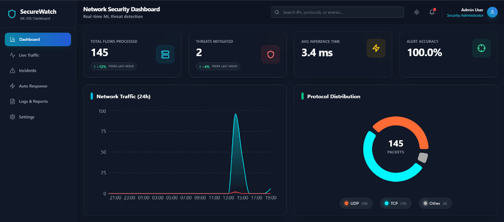
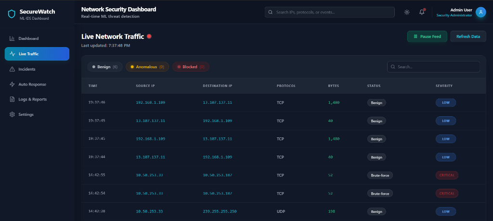
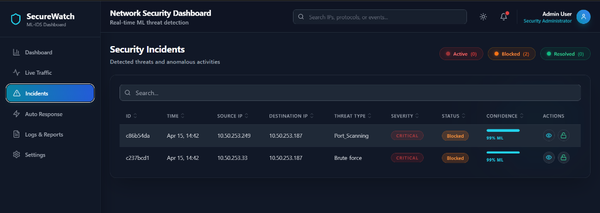

# SecureWatch ML-IDS 🛡️

**SecureWatch ML-IDS** is a high-performance, real-time Network Intrusion Detection and Automated Response System. It leverages **Ensemble Learning** and a novel **Asymmetric SMOTE-ENN** data engineering pipeline to detect and mitigate sophisticated cyber-threats with sub-10ms latency.

---

## 🚀 Key Features

-   **Asymmetric SMOTE-ENN Pipeline:** Solves the "False Positive Trap" by balancing minority attack classes (DoS, Botnet, Infiltration) without introducing synthetic noise into benign traffic.
-   **Real-Time Dashboard:** A full-stack security cockpit built with **React.js** and **Django Channels**, featuring live WebSocket updates for traffic and incident monitoring.
-   **Sub-4ms Inference:** Highly optimized classification using a **Top-20 Gini-Importance feature subset**, allowing the system to handle high-velocity enterprise traffic.
-   **Automated Bidirectional Mitigation:** Instantly isolates confirmed attackers at the network layer by blocking both Inbound and Outbound traffic via Windows Firewall API integration.
-   **Forensic Auditing:** Maintains complete, timestamped logs for every detection and mitigation event.

---

## 🖼️ Visual Overview

### 1. Main Security Dashboard

*Real-time monitoring of network flows, mitigated threats, and sub-4ms ML inference latency.*

### 2. Live Traffic & Multi-Class Classification

*Granular classification of packets into Benign, Brute-force, and other malicious categories.*

### 3. Automated Incident Isolation

*High-confidence threat detection with instant IP-level isolation status.*

---

## 🛠️ Tech Stack

-   **Backend:** Python 3.10+, Django 4.2+, Django Channels (WebSockets)
-   **Frontend:** React.js, TailwindCSS, Chart.js
-   **Machine Learning:** Scikit-learn, Imbalanced-learn (Asymmetric SMOTE-ENN)
-   **Network:** Scapy (Live Packet Sniffing & Feature Extraction)
-   **Database:** SQLite/PostgreSQL
-   **Security Engine:** Windows netsh API / Firewall Integration

---

## 📊 Dataset Benchmark

The model is trained on the **CSE-CIC-IDS2018** dataset, the current global benchmark for realistic network traffic analysis. It specifically addresses multi-vector threats including:
-   **DoS / DDoS Attacks**
-   **Port Scanning & Reconnaissance**
-   **Botnet Command & Control**
-   **Web Attacks & Infiltration**

---

## 👥 Project Team

- **Piyush Parate** (202204045)
- **Chintan Parmar** (202204046)
- **Siddhesh Surve** (202204057)
- **Vashisht Urgonda** (202204060)

---

## 📜 License

This project is licensed under the **MIT License** - see the [LICENSE](LICENSE) file for details.

---

## 🎓 Academic Contribution

This project was developed as a final-year engineering thesis. It bridges the gap between theoretical ML research and practical, low-latency cybersecurity software engineering.
