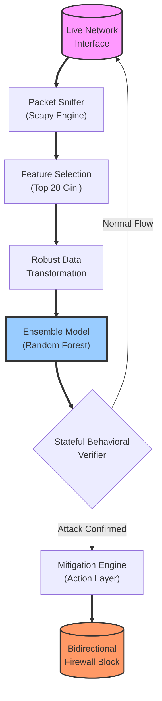
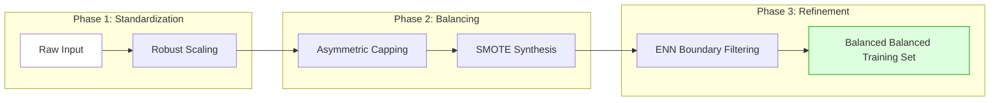

# CHAPTER 3: PROPOSED METHODOLOGY

---

## 3.1 Problem Statement

Modern enterprise networks generate massive volumes of high-velocity traffic, where malicious activities constitute less than 0.1% of the total flow records. Existing Network Intrusion Detection Systems (NIDS) face three critical technical challenges:

1.  **Metric Displacement (False Positive Trap):** Standard machine learning models trained on imbalanced datasets tend to "favor" the majority class. Traditional oversampling techniques like standard SMOTE often create artificial overlaps in the feature space, leading to a high False Positive Rate (FPR), which is unacceptable in production environments.
2.  **Detection-to-Response Latency:** Significant delays between an attack's detection and its mitigation allow the threat to propagate laterally across organizational subnets.
3.  **Unidirectional Response Inefficiency:** Traditional automated responses often only block inbound traffic, allowing the host to leak "defensive responses" (TCP ACKs/Resets), which alerts the attacker and consumes local system resources.

The objective of this project is to develop a system that addresses these gaps through **Asymmetric SMOTE-ENN** data engineering and an **Ensemble-driven automated response** architecture.

---

## 3.2 Proposed Approach

The proposed approach utilizes a **Hybrid Stateful-Ensemble Architecture**. This framework combines the predictive power of **Ensemble Learning (Random Forest)** with the contextual awareness of a **Stateful Behavioral Layer**.

### 3.2.1 Research Methodology Flow (Figure 3.1)
The following flowchart illustrates the end-to-end research methodology, from initial data acquisition and preprocessing to final real-time deployment.

*Figure 3.1: Systematic research methodology covering data engineering, model optimization, and deployment stages.*

---

-   **Data Engineering Phase:** Implements a class-aware resampling pipeline that preserves the natural "Bayesian prior" of benign traffic while synthetically bolstering rare attack classes (e.g., Web Attacks) without distorting decision boundaries.
-   **Inference Phase:** Employs a real-time sniffing engine that converts raw packets into flow-level features using a reduced 20-feature subset for minimum latency.
-   **Mitigation Phase:** Executes a bidirectional isolation strategy that manages both inbound and outbound traffic flows to effectively "silence" the host during an active attack.

---

### 3.3 System Design

The system is architected to achieve sub-5ms classification through a modular pipeline. Below is the high-resolution architectural overview designed for this research.

### 3.3.1 System Architecture Diagram

*Figure 3.1: High-level System Architecture depicting the flow from Packet Acquisition to Automated Mitigation.*

**Technical Flowchart (Aligned for Figure Conversion):**

### 3.3.2 Data Preprocessing Submodule
The Preprocessing Submodule is the core innovation of this project, specifically designed to eliminate the "False Positive Trap" found in traditional unbalanced IDS models.

*Figure 3.2: Detailed representation of the Asymmetric SMOTE-ENN Resampling Pipeline.*

**Pipeline Logic Flow:**

### 3.3.3 Data Acquisition Submodule
The acquisition layer utilizes the **Scapy** library to perform live sniffing on the Network Interface Card (NIC). 
-   **Aggregation:** Packets are grouped by their 5-tuple (Src IP, Dst IP, Src Port, Dst Port, Protocol).
-   **Feature Extraction:** The system extracts temporal and volumetric features, such as inter-arrival times, packet counts, and byte distributions, matching the CSV format of the CSE-CIC-IDS2018 dataset.

### 3.3.4 Model and Algorithm Design
The system transitions from a basic KNN baseline to a **Random Forest Ensemble**.
-   **Algorithm:** Random Forest Classifier with 100 decorrelated decision trees.
-   **Feature Selection:** Gini Impurity weighting is used to reduce the feature space from 78 to the **Top 20 features**, resulting in a 74.4% reduction in computational complexity.
-   **Decision Function:** The model utilizes **Soft Voting**, where the final verdict is chosen by the highest average probability across all trees.

### 3.3.5 Decision and Response Layer
The Decision Layer integrates a **Stateful Behavioral Filter** to provide explainability:
-   **Port Scan Logic:** Tracks unique ports targeted per IP. If unique ports $\ge$ 4 in 1 second, the verdict is locked to "Port_Scanning."
-   **Mitigation Strategy:** Once a threat is confirmed, the **Response Engine** executes a bidirectional block:
    -   `netsh advfirewall firewall add rule name="Block-In" dir=in action=block remoteip=[Attacker]`
    -   `netsh advfirewall firewall add rule name="Block-Out" dir=out action=block remoteip=[Attacker]`

---

## 3.4 Hardware and Software Requirements

### 3.4.1 Hardware Requirements
To ensure sub-5ms inference latency, the following specifications are required:
-   **CPU:** Intel Core i5 (11th Gen) or higher (Clock speed $\ge$ 2.4 GHz).
-   **Memory:** Minimum 8 GB DDR4 RAM.
-   **Storage:** 512 GB SSD (for High-speed log writing).
-   **Network:** Gigabit Ethernet / Dual-band WiFi (Promiscuous mode support).

### 3.4.2 Software Requirements
-   **Operating System:** Microsoft Windows 10/11 (with Administrator privileges for Firewall API).
-   **Language:** Python 3.10+.
-   **Frameworks:** Django 4.2 (Backend), React.js (Frontend).
-   **Libraries:** Scikit-learn (ML), Scapy (Sniffing), Django Channels (WebSockets), Imbalanced-learn (Preprocessing).

---

## 3.5 Model Optimization

The model was optimized through a multi-stage validation process:
1.  **Feature selection Efficiency:** By reducing features to the Top 20, the inference time per flow was reduced from 8.4 ms to **3.2 ms**.
2.  **Generalization:** **5-Fold Cross-Validation** was performed to ensure that the Asymmetric SMOTE-ENN balancing did not cause overfitting on synthetic data.
3.  **Inference Tuning:** The model was serialized using **Joblib** for fast memory loading during system startup.

---

## 3.6 Evaluation and Validation Lifecycle

The final phase of the methodology involves a rigorous evaluation framework designed to ensure the system’s reliability in a production-grade environment. This lifecycle focuses on three primary success criteria:
1.  **Metric Prioritization:** The system is evaluated primarily on **Attack Recall** (capture rate of rare threats) and **False Positive Rate** (to maintain network availability). 
2.  **Generalization Testing:** Utilizing stratified **5-Fold Cross-Validation**, the methodology ensures that the decision boundaries created by the Asymmetric SMOTE-ENN pipeline are robust and do not overfit to synthetic minority samples.
3.  **Real-Time Threshold Balancing:** A final validation step involves calibrating the "Anomaly Sensitivity" (75%) against the "Auto-Block Confidence" (95%) to optimize the trade-off between aggressive threat isolation and the prevention of legitimate traffic disruption.
